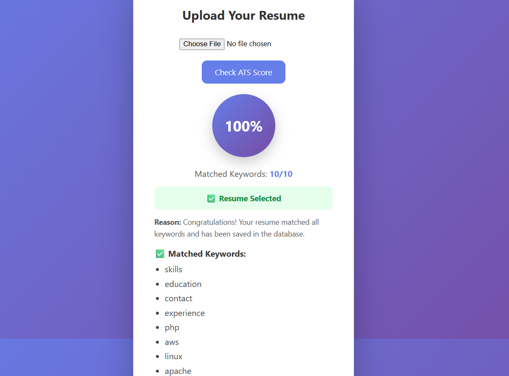
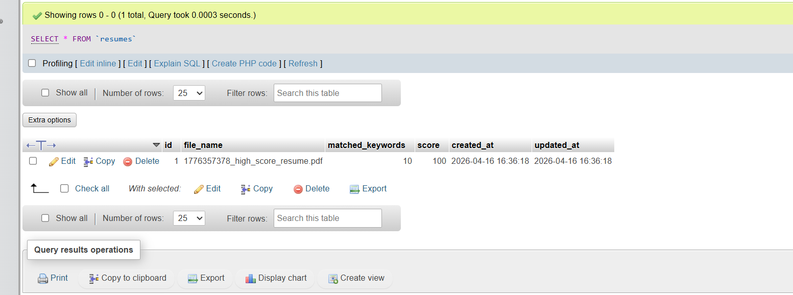

# 🚀 Resume ATS Checker

### Smart Resume Screening System Built with Laravel

---

## 📌 Overview

**Resume ATS Checker** is a web-based application that analyzes resumes using keyword matching, similar to real-world Applicant Tracking Systems (ATS).

It helps users understand how well their resume performs by generating an ATS score and providing detailed insights.

---

## 🖼️ Project Preview

### 🔹 ATS Score Result UI



### 🔹 Database Storage (MySQL)



---

## ✨ Key Highlights

* 📄 Supports PDF and TXT resume formats
* 🔍 Intelligent keyword-based analysis
* 📊 Real-time ATS score calculation
* ✅ Clear selection / rejection system
* 📌 Matched & missing keyword insights
* 💾 Automatic database storage (only for perfect matches)
* 🎯 Clean and modern UI

---

## ⚙️ Technology Stack

| Layer       | Technology       |
| ----------- | ---------------- |
| Backend     | Laravel (PHP)    |
| Frontend    | HTML, CSS        |
| Database    | MySQL            |
| PDF Parsing | smalot/pdfparser |

---

## 🧠 System Workflow

1. User uploads resume (PDF/TXT)
2. System extracts and processes text
3. Text is normalized (lowercase & cleaned)
4. Keywords are matched against predefined list
5. ATS score is calculated dynamically
6. System generates:

   * Score percentage
   * Matched keywords
   * Missing keywords
   * Final decision (Selected / Rejected)
7. Only 100% matched resumes are stored in the database

---

## 📊 Scoring Logic

| Score Range | Result     | Description                  |
| ----------- | ---------- | ---------------------------- |
| 100%        | ✅ Selected | Fully optimized resume       |
| 80%+        | ❌ Rejected | Minor improvements needed    |
| 50%+        | ❌ Rejected | Significant keywords missing |
| <50%        | ❌ Rejected | Poor ATS compatibility       |

---

## 📁 Project Structure

```bash
app/
 ├── Http/Controllers/ResumeController.php
 ├── Models/Resume.php

database/
 ├── migrations/

resources/
 ├── views/index.blade.php

routes/
 ├── web.php
```

---

## ⚡ Installation

```bash
git clone https://github.com/pappu-kumar-sarkar/resume-checker.git
cd resume-checker
composer install
cp .env.example .env
php artisan key:generate
php artisan migrate
php artisan serve
```

---


---

## 📌 Database Schema

| Column           | Type    |
| ---------------- | ------- |
| id               | Integer |
| file_name        | String  |
| matched_keywords | Integer |
| score            | Integer |
| timestamps       | Default |

---

## 🔮 Future Enhancements

* 🤖 AI-based resume analysis
* 📄 DOCX support
* 📊 Advanced scoring system
* 🔐 User authentication
* 🌐 Live deployment

---

## 👨‍💻 Author

**Pappu Kumar Sarkar**
Laravel Developer | Web Developer

---

## 🌐 Repository

🔗 https://github.com/pappu-kumar-sarkar/resume-checker

---

## ⭐ Support

If you found this project useful, please give it a ⭐ on GitHub!
